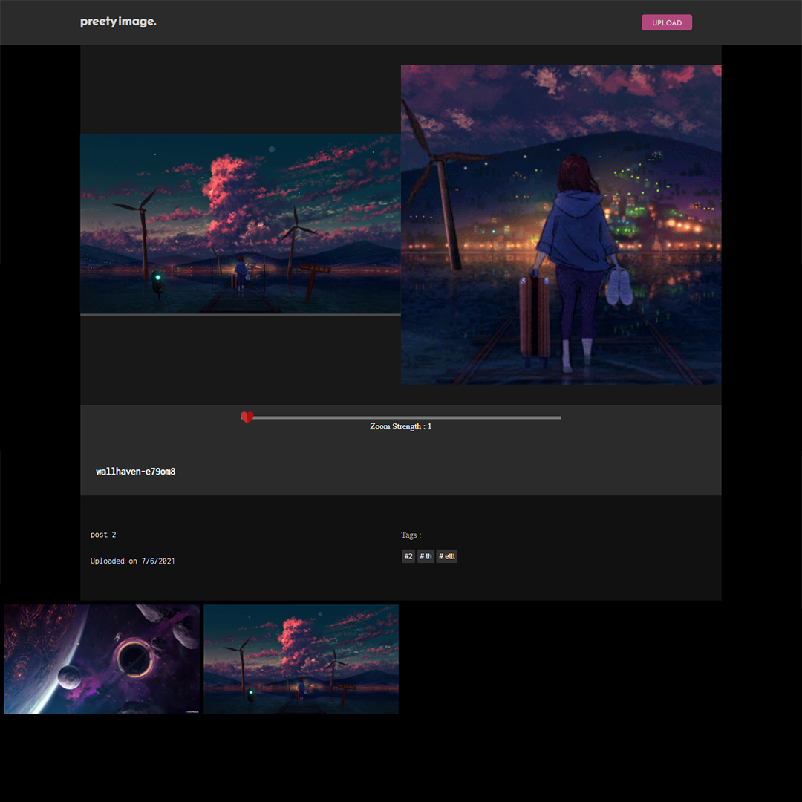

# Stock-images-server
A NodeJS project which handles both backend and front and of a Stock Image Sharing platform. 
With the help of node modules like JIMP, nedb, ejs, express and async.

***USAGE***
Start the server by running the 'index.js' file.
```node index.js```

On the home page, random image from the database is served along with the thumbnails of other images available.

