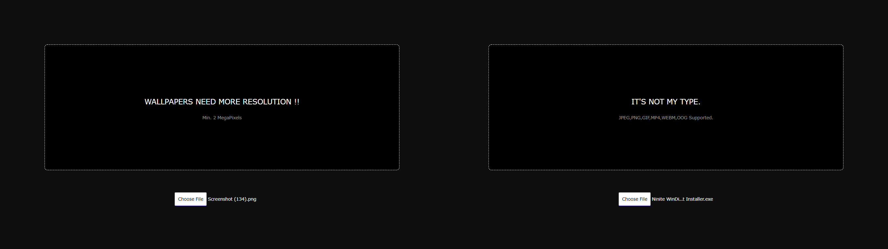

<h1 align="center">Stock-images-server</h1>  
  

<p align="left">  A NodeJS project which handles both backend and front and of a Stock Image Sharing platform. 
Devoloped with the help of node modules like JIMP, nedb, ejs, express and async.</p>
  
    
## USAGE :
Start the server by running the 'index.js' file.  
```
node index.js
```

On the home page, random image from the database is served along with the thumbnails of other images available.  


### Users can also upload file on the server through the upload page.  

Where they can drag and drop the file and the page will check the if the file meets the specified requirements of the server.
If files don't match the requirements, users will be get a message about which required parameter their file lacks.



If the file matches the required parameters then a form will appear where users can fill in the details of the image.


After the uploading to the server image will be processed and it's different sized versions will be created for thumbnail purpose.

## Compatibility :  
NodeJS v14.17.3 or higher.

## Warning :  
This program requires systems with minimum 2 GB RAM for processing images.
Running this on systems like Raspberry Pi may raise a error related to insufficient memory.
